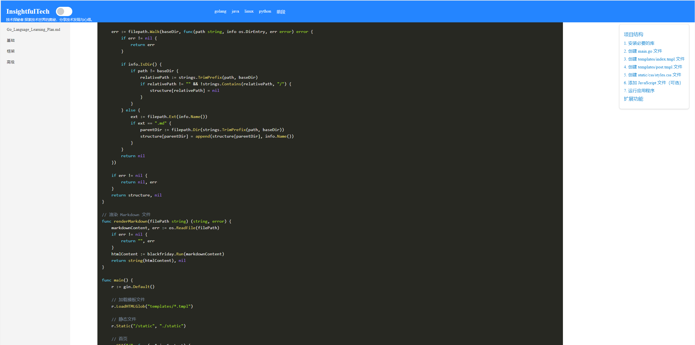

# 技术探秘者博客网站

探索技术世界的奥秘，分享技术发现与心得。

## 项目简介

本项目是一个简单的博客网站，使用 Go 语言的 Gin 框架作为后端，前端使用 React.js。
后端项目在启动的时候可以通过-config 执行markdown文件的目录，作为网站导航和内容，该网站能够读取markdown目录作为网站导航，顶部导航栏显示目录结构，右侧显示导航下面子分类，点击文件名可显示 Markdown 文章内容。

常规模式


暗黑模式


### 功能

- 支持在config.yaml中 定义读取markdown存放项目的路径，例如我的项目路径为posts
- 支持posts(可以自定义)目录下面的第一个markdown文件为首页显示的内容
- 支持语法高亮
- 支持开启黑暗模式
- 支持左侧菜单折叠
- 显示markdown文档的时候，右侧有当前文档导航


## 技术栈

### 前端

- **React.js**: ^18.3.1
- **Vite**: ^5.4.2
- **react-markdown**: ^9.0.1
- **react-router-dom**: ^6.26.1
- **react-syntax-highlighter**: ^15.5.0
- **remark-gfm**: ^4.0.0

### 后端

- **Go Gin**: v1.10.0
- **Logrus**: v1.9.3
- **Viper**: v1.19.0
- **Swagger**: v1.6.0, v1.16.3
- **Lumberjack**: v2.2.1

## 项目结构

```
├── frontend         # 前端代码
│   ├── src          # 源代码
│   └── public       # 公共资源
├── backend          # 后端代码
│   ├── config/                # 配置文件夹
│   │  └── config.go          # 配置加载逻辑
│   ├── controllers/           # 控制器文件夹
│   │  └── markdown.go        # 处理Markdown相关的控制器
│   ├── middleware/            # 中间件文件夹
│   │  └── logger.go          # 日志中间件
│   ├── models/                # 模型文件夹（如果使用ORM或数据库，可以放模型）
│   │  └── file.go            # 定义文件和目录相关的结构
│   ├── routes/                # 路由文件夹
│   │   └── routes.go          # 路由设置
│   ├── services/              # 业务逻辑文件夹
│   │   └── file_service.go    # 文件和目录读取的业务逻辑
│   ├── utils/                 # 工具类文件夹
│   │   └── response.go        # 封装响应格式
│   ├── content/               # 本地Markdown目录（示例）
│   ├── go.mod                 # Go 模块文件
│   └── main.go                # 主程序入口
├── image      # 截图文件
└── posts    # 存放要显示的markdown内容文件地方
```

## 安装与运行

### 前端

1. 进入前端目录

   ```bash
   cd frontend
   ```

2. 安装依赖

   ```bash
   npm install
   ```

3. 启动开发服务器

   ```bash
   npm run dev
   ```

### 后端

1. 进入后端目录

   ```bash
   cd backend
   ```

2. 安装依赖

   ```bash
   go mod tidy
   ```

3. 启动服务器

   ```bash
   go run main.go
   ```


