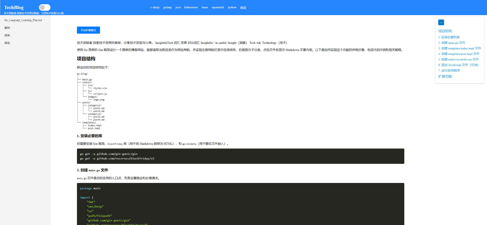
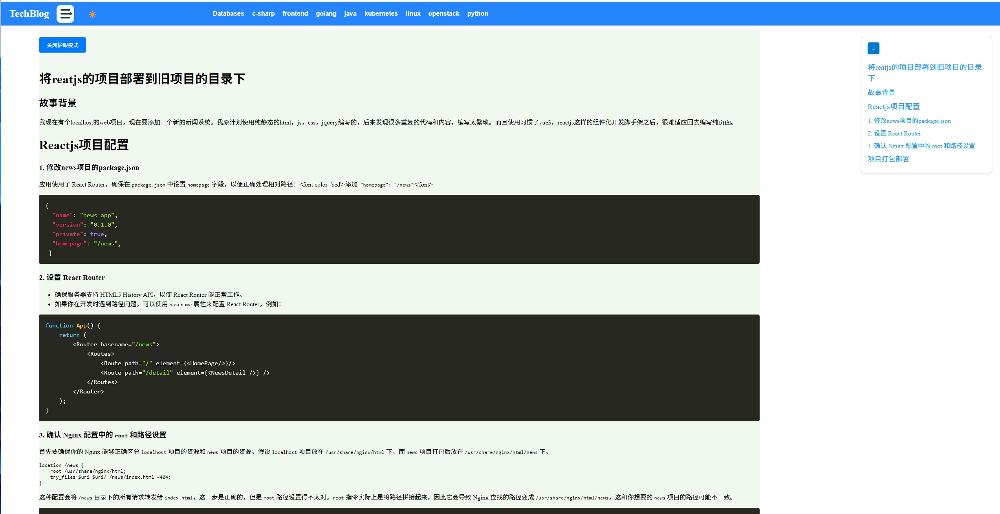
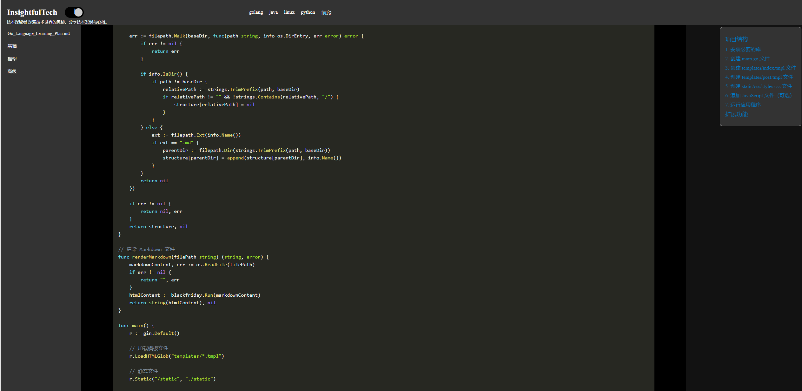
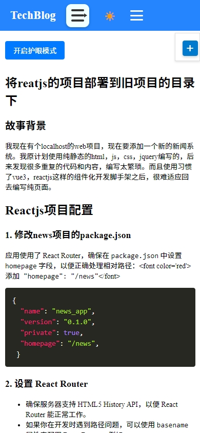
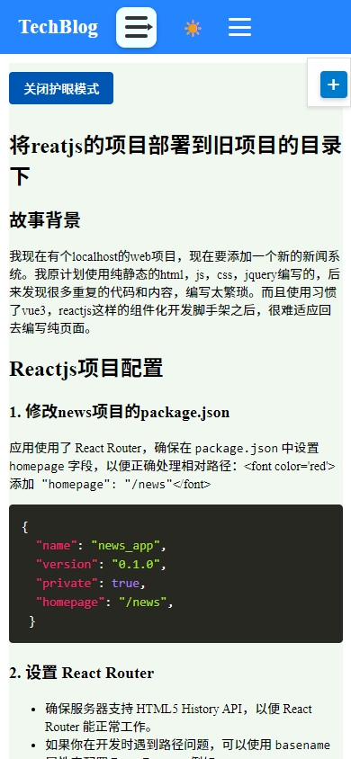
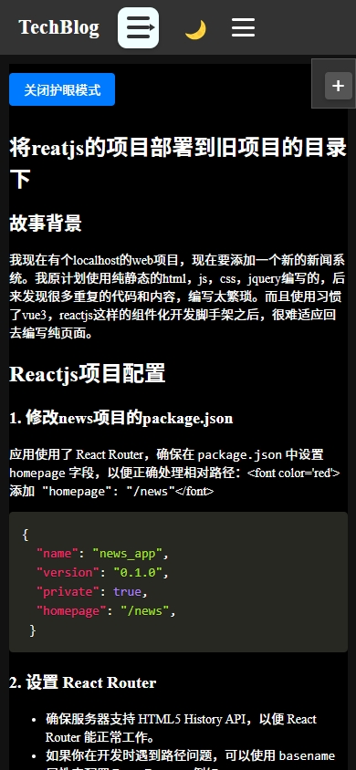

<p align="center">
  
</p>

<h1 align="center">TechBlog</h1>

<p align="center">
  基于 Go + React 的 Markdown 博客系统，将本地 Markdown 文件夹变成结构化的在线文档站点
</p>

<p align="center">
  <a href="https://github.com/caojp/tech-blog/actions"></a>
  
  
  
  
</p>

---

## 目录

- [功能特性](#功能特性)
- [截图预览](#截图预览)
- [技术栈](#技术栈)
- [前置条件](#前置条件)
- [快速开始](#快速开始)
- [项目结构](#项目结构)
- [内容目录约定](#内容目录约定)
- [配置说明](#配置说明)
- [部署](#部署)
- [参与贡献](#参与贡献)
- [开源许可](#开源许可)

## 功能特性

- 📂 **目录即导航** — 自动读取 Markdown 目录结构，生成顶部+左侧多级导航
- 📝 **Markdown 渲染** — 支持 GFM 语法、代码高亮（5 种风格可切换）、一键复制代码
- 🌗 **主题切换** — 亮色 / 暗色 / 护眼模式，支持跟随系统偏好，本地持久化
- 📱 **响应式适配** — 桌面端可拖拽侧边栏，移动端抽屉式导航
- 📑 **文档目录** — 自动提取文章标题生成右侧 TOC，支持锚点跳转
- 🔗 **可分享链接** — 文章路径写入 URL，刷新即恢复，支持直接分享
- 🔒 **路径安全** — 后端路径穿越防护，确保只能访问 ContentDir 内的文件
- ⚡ **性能优化** — 代码高亮按需加载、后端目录树缓存、组件 memo 优化

## 截图预览

#### 常规模式


#### 护眼模式


#### 暗黑模式


#### 移动端
<p float="left">
  
  
  
</p>

## 技术栈

| 层 | 技术 | 版本 |
|---|---|---|
| **前端** | React + Vite | 18 / 5 |
| | react-markdown + remark-gfm | 9 / 4 |
| | react-syntax-highlighter (PrismLight 按需加载) | 15 |
| | react-router-dom | 6 |
| **后端** | Go + Gin | 1.22 / 1.10 |
| | Viper (配置) | 1.19 |
| | Logrus + Lumberjack (日志) | 1.9 / 2.2 |
| | Swagger (API 文档) | 1.16 |

## 前置条件

- **Go** ≥ 1.22
- **Node.js** ≥ 18
- **npm** ≥ 9（或 pnpm / yarn）

## 快速开始

### 1. 克隆仓库

```bash
git clone https://github.com/caojp/tech-blog.git
cd tech-blog
```

### 2. 启动后端

```bash
cd backend
go mod tidy
go run main.go
```

后端默认运行在 `http://localhost:8080`，API 文档位于 `http://localhost:8080/swagger/index.html`。

### 3. 启动前端

```bash
cd frontend
npm install
npm run dev
```

前端开发服务器默认运行在 `http://localhost:5173`。

### 4. 添加你的文章

在项目根目录创建 `posts/` 文件夹，放入 Markdown 文件（参见[内容目录约定](#内容目录约定)）。

> 也可使用 Makefile 一键启动：`make dev`

## 项目结构

```
tech-blog/
├── backend/                  # Go 后端
│   ├── config/               # 配置加载
│   ├── controllers/          # 控制器
│   ├── middleware/           # 中间件（日志等）
│   ├── models/               # 数据模型
│   ├── routes/               # 路由
│   ├── services/             # 业务逻辑
│   ├── utils/                # 工具函数
│   ├── docs/                 # Swagger 文档
│   └── main.go               # 入口
├── frontend/                 # React 前端
│   ├── src/
│   │   ├── api/              # API 请求
│   │   ├── components/       # 组件
│   │   ├── pages/            # 页面
│   │   └── styles/           # 样式
│   └── package.json
├── posts/                    # Markdown 内容目录（用户自行创建）
├── image/                    # README 截图
├── Makefile                  # 常用命令
├── Dockerfile                # 容器化
├── docker-compose.yml        # 一键编排
└── README.md
```

## 内容目录约定

```
posts/
│   index.md                  # 首页展示的内容
│
├───golang                    # 一级目录 → 顶部导航
│   │   Go_Learning_Plan.md   # 文章 → 左侧导航
│   │
│   ├───基础                  # 二级目录 → 左侧可折叠
│   │       post1.md
│   │
│   └───框架
│       ├───gin              # 三级目录 → 左侧可折叠
│       └───orm
│
├───kubernetes
├───linux
└───python
```

- 顶层目录显示在**顶部导航栏**
- 子目录和文件显示在**左侧导航栏**，支持多级折叠
- `index.md` 作为首页默认内容

## 配置说明

后端配置文件 `backend/config.yaml`：

```yaml
ServerPort: ":8080"          # 服务端口
ContentDir: "../posts"       # Markdown 内容目录路径

LOG:
  LEVEL: "info"              # 日志级别: debug/info/warn/error
  ROTATE_DAYS: 7             # 日志轮转天数
  FORMAT: "json"             # 日志格式: json/text
```

也可通过命令行参数指定配置文件：

```bash
go run main.go -config path/to/config.yaml
```

## 部署

### 方式一：手动构建

```bash
# 后端
cd backend
go build -o tech-blog .
./tech-blog -config config.yaml

# 前端
cd frontend
npm run build                # 产物在 dist/
```

### 方式二：Docker

```bash
docker compose up -d         # 一键启动前后端
```

详见 [docker-compose.yml](docker-compose.yml)。

### 方式三：交叉编译（Linux 部署）

```bash
cd backend
make build-linux             # 生成 linux/amd64 二进制
```

## 参与贡献

欢迎提交 Issue 和 PR！请先阅读 [贡献指南](CONTRIBUTING.md)。

- 提交前请确保 `make lint` 和 `make test` 通过
- 遵循 [约定式提交](https://www.conventionalcommits.org/zh-hans/) 规范
- 报告安全漏洞请参见 [安全策略](SECURITY.md)

## 开源许可

本项目基于 [MIT License](LICENSE) 开源。
