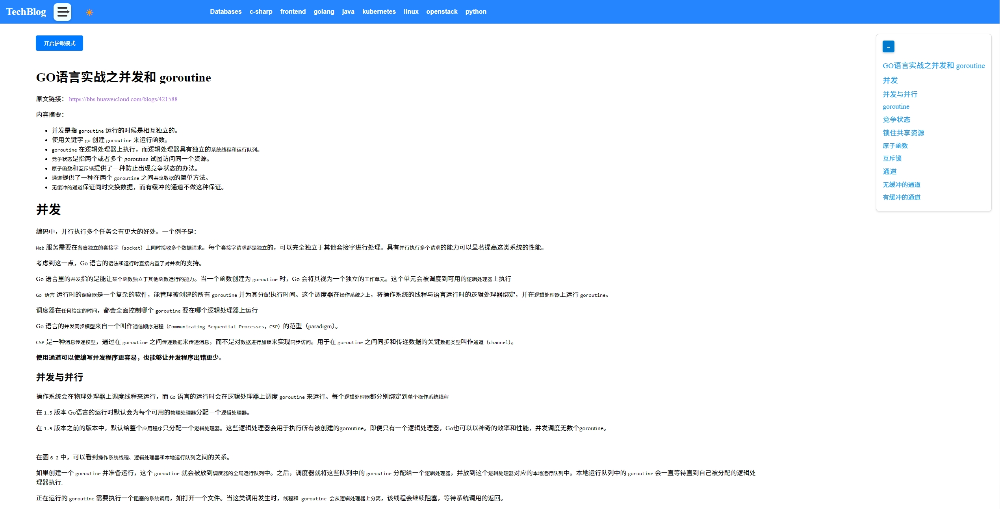
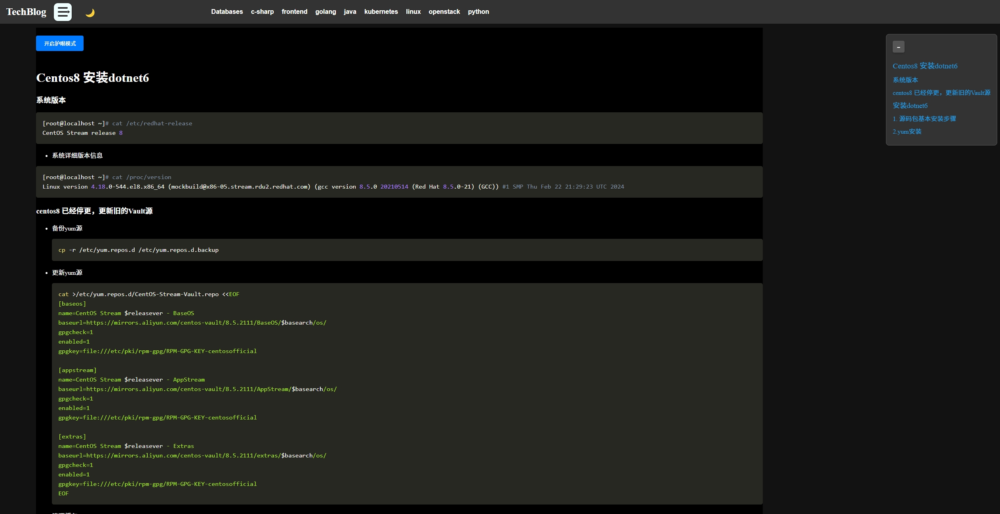

# TechBlog 
作为一个技术性学习者，开发者，我们经常会使用markdown记录笔记，写一些博客。
以前写博客，大部分都是到某个博客后台去使用富文本编辑，然后发布到博客网站显示在前台。这个过程中，需要我们联网，在网页编辑有些麻烦，经常性会有格式显示异常，来回调整。
我正是由于这一点，所以很少去记录博客。偶尔一些比较重要的东西要么有道云笔记，要么使用typora写markdown笔记保存到本地电脑，但是这样有一些缺点，那就是每次查看笔记都需要打开电脑。
后台我发现有gitbook.io网站， 可以将github作为markdown文档的存储仓库，gitbook上面设置你的github仓库地址就可以显示，非常有好，没有那么多的广告内容，也不花里胡哨，可以完成沉侵式阅读。
正好这段时间有空，我也想为自己做这么一个网站。将自己的那么markdown笔记分享出去，这是我的一个练手项目，如有瑕疵，还请包涵，提交issue，我看到后，回去修复。


## 项目简介

TechBlog是一个展示markdown文档的博客网站，网站导航和内容，该网站能够读取markdown目录作为网站导航，顶部导航栏显示目录结构，右侧显示导航下面子分类，点击文件名可显示 Markdown 文章内容。

使用 Go 语言的 Gin 框架作为后端，前端使用 React.js。 


**网站内容目录**

```shell
TECH-BLOG\POSTS
│   index.md                               // 主页显示的内容
│
├───c-sharp                                // 一级目录 顶部导航栏（TopNav） 显示父类目
│       Centos8 安装dotnet6.md             // 二级以下的目录和文件 都会显示在左侧导航栏(SideNav) ，如果是markdown文件，点击后会在中间文档显示区域显示内容。如果左侧是目录，可以折叠，展开显示。
│
├───golang                                // 二级目录显示在左侧
│   │   Go_Language_Learning_Plan.md      // 二级目录下面的markdown文档，点击后可以显示文档内容。
│   │
│   ├───基础
│   │       post1.md
│   │
│   ├───框架
│   │   ├───beego          // 三级目录会显示在左侧导航栏
│   │   ├───gin
│   │   └───orm
│   └───高级
│           golang常见的10种设计模式.md
│
├───java
│   ├───基础
│   │   │   base.md
│   │   │
│   │   └───基础
│   ├───面向对象
│   │       obj.md
│   │
│   └───高级
│           type.md
│
├───kubernetes
├───linux
│   │   Linux 系统内存和进程内存分析.md
│   │
│   ├───内核
│   │       post1.md
│   │
│   ├───命令
│   │       post1.md
│   │
│   └───网络
│           post1.md
│
├───openstack
├───python
│   │   post1.md
│   │
│   ├───基础
│   │       post1.md
│   │
│   ├───框架
│   │       post1.md
│   │       Tornado.md
│   │
│   ├───爬虫
│   │       post1.md
│   │
│   └───高级
│           post1.md
│
└───前段
    ├───CSS
    │       post1.md
    │
    ├───HTML
    │       post1.md
    │
    ├───JS
    │       post1.md
    │
    ├───React
    │       post1.md
    │
    ├───Vue
    │       post1.md
    │
    └───小程序
            post1.md

```

### 后端打包后启动
```shell
cd backend
go build -o tech-blog
chmod u+x tech-blog
./tech-blog -config config/config.yaml
```
在config.yaml中配置好网站目录:
```yaml
ServerPort: ":8080"
ContentDir: "../posts"
LOG:
   LEVEL: "debug"
   ROTATE_DAYS: 7
   FORMAT: "json"
```
- ServerPort： 服务器启动端口
- ContentDir： 就是网站存放markdown的内容目录
- LOG： 日志配置项


#### 常规模式



#### 护眼模式


#### 暗黑模式



### 功能

- 支持在config.yaml中 定义读取markdown存放项目的路径，例如我的项目路径为posts
- 支持posts(可以自定义)目录下面的第一个markdown文件为首页显示的内容
- 支持语法高亮
- 支持开启黑暗模式
- 支持左侧菜单折叠
- 显示markdown文档的时候，右侧有当前文档导航

## 技术栈

### 前端

- **React.js**: ^18.3.1
- **Vite**: ^5.4.2
- **react-markdown**: ^9.0.1
- **react-router-dom**: ^6.26.1
- **react-syntax-highlighter**: ^15.5.0
- **remark-gfm**: ^4.0.0

### 后端

- **Go Gin**: v1.10.0
- **Logrus**: v1.9.3
- **Viper**: v1.19.0
- **Swagger**: v1.6.0, v1.16.3
- **Lumberjack**: v2.2.1

## 项目结构

```
├── frontend         # 前端代码
│   ├── src          # 源代码
│   └── public       # 公共资源
├── backend          # 后端代码
│   ├── config/                # 配置文件夹
│   │  └── config.go          # 配置加载逻辑
│   ├── controllers/           # 控制器文件夹
│   │  └── markdown.go        # 处理Markdown相关的控制器
│   ├── middleware/            # 中间件文件夹
│   │  └── logger.go          # 日志中间件
│   ├── models/                # 模型文件夹（如果使用ORM或数据库，可以放模型）
│   │  └── file.go            # 定义文件和目录相关的结构
│   ├── routes/                # 路由文件夹
│   │   └── routes.go          # 路由设置
│   ├── services/              # 业务逻辑文件夹
│   │   └── file_service.go    # 文件和目录读取的业务逻辑
│   ├── utils/                 # 工具类文件夹
│   │   └── response.go        # 封装响应格式
│   ├── content/               # 本地Markdown目录（示例）
│   ├── go.mod                 # Go 模块文件
│   └── main.go                # 主程序入口
├── image      # 截图文件
└── posts    # 存放要显示的markdown内容文件地方
```

## 安装与运行

### 前端

1. 进入前端目录

   ```bash
   cd frontend
   ```
2. 安装依赖

   ```bash
   npm install
   ```
3. 启动开发服务器

   ```bash
   npm run dev
   ```

### 后端

1. 进入后端目录

   ```bash
   cd backend
   ```
2. 安装依赖

   ```bash
   go mod tidy
   ```
3. 启动服务器

   ```bash
   go run main.go
   ```
